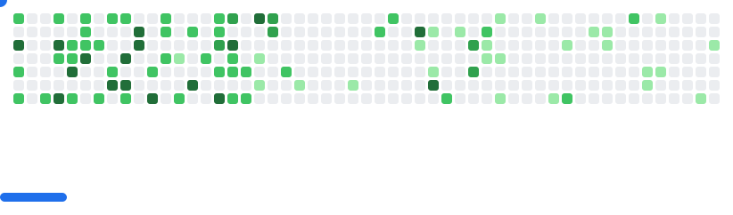

- Hi, Im Danish
- Got a freelance gig? Hit me up via <a href="mailto:danishh.h@icloud.com">email</a> OR check me out on <a href="https://www.upwork.com/freelancers/~01b9a46df790944107?mp_source=share">Upwork</a>

<!--

  <table style="font-size: 11px">
  <tr>
  <td valign="top" width="50%">
  
  #### 🖥️ Windows Power User

  Enjoy the flexibility windows gives me. Grown fond of using WSL on windows lately!
  
  
  
  
  
  </td>
  <td valign="top" width="50%">
  
  #### 🐧 Linux Enthusiast
  
  I love working with Linux and Im always exploring new things in the vast open-source world.
  
  
  
  

  
  </td>
  </tr>
  </table>

<!-- <picture>
  <source
    media="(prefers-color-scheme: dark)"
    srcset="images/breakout-dark.svg"
  />
  <source
    media="(prefers-color-scheme: light)"
    srcset="images/breakout-light.svg"
  />
  
</picture> -->
